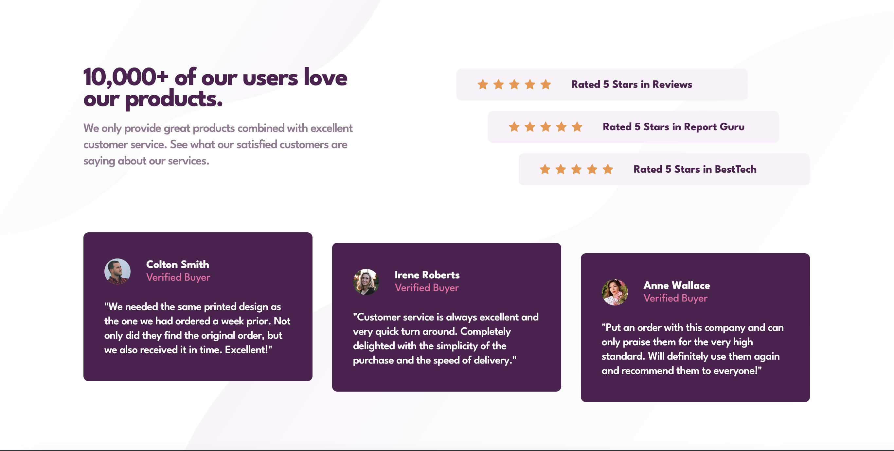

# Social proof section solution

This is a solution to the [Social proof section challenge on Frontend Mentor](https://www.frontendmentor.io/challenges/social-proof-section-6e0qTv_bA).

## Table of contents

- [Overview](#overview)
  - [The challenge](#the-challenge)
  - [Screenshot](#screenshot)
  - [Links](#links)
- [My process](#my-process)
  - [Built with](#built-with)
  - [What I learned](#what-i-learned)
  - [Continued development](#continued-development)
  - [Useful resources](#useful-resources)
- [Author](#author)

## Overview

### The challenge

Users should be able to:

- View the optimal layout for the section depending on their device's screen size

### Screenshot



### Links

- [Solution on frontendmentor.io]()
- [Live preview]()

## My process

### Built with

- Semantic HTML5 markup
- CSS custom properties
- Flexbox
- Mobile-first workflow
- BEM methodology

### What I learned

In this project I learn more about working with svg files. Reusing svg image throughout the application perfectly align with DRY principle. Below you can take a look at piece of code from this project. Also, this design made me think more about responsiveness and how to manage elements on page to look good.

```html
<symbol xmlns="http://www.w3.org/2000/svg" id="star" viewBox="0 0 16 17">
  <path d="M16.539 6.097a.297.297 0 00-.24-.202l-5.36-.779L8.542.26a.296.296 0 00-.53 0L5.613 5.117l-5.36.779a.297.297 0 00-.165.505l3.88 3.78-.917 5.34a.297.297 0 00.43.312l4.795-2.52 4.794 2.52a.296.296 0 00.43-.313l-.916-5.338L16.464 6.4c.08-.08.11-.197.075-.304z" fill="#EF9546" fill-rule="nonzero"/>
</symbol>

<div class="ratings__stars">
  <svg width="16" height="17" viewBox="0 0 16 17"><use xlink:href="#star"></use></svg>
  <svg width="16" height="17" viewBox="0 0 16 17"><use xlink:href="#star"></use></svg>
  <svg width="16" height="17" viewBox="0 0 16 17"><use xlink:href="#star"></use></svg>
  <svg width="16" height="17" viewBox="0 0 16 17"><use xlink:href="#star"></use></svg>
  <svg width="16" height="17" viewBox="0 0 16 17"><use xlink:href="#star"></use></svg>
</div>
```

### Continued development

I still don't feel completely comfortable with svg. It's one thing to just add them on page but other to have a full understanding what you can achieve by using them and tricks associated with it.

### Useful resources

- [HTML <symbol>](https://developer.mozilla.org/en-US/docs/Web/SVG/Element/symbol) and [HTML <use>](https://developer.mozilla.org/en-US/docs/Web/SVG/Element/use) - This documentation gave me a better understanding how SVG file can be reused.

## Author

- Github - [@PiwkoO](https://github.com/PiwkoO)
- Frontend Mentor - [@PiwkoO](https://www.frontendmentor.io/profile/PiwkoO)